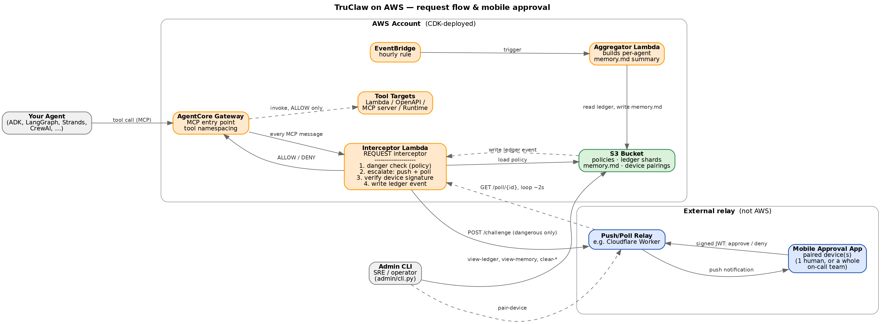

# TruClaw

TruClaw is a policy and human-approval layer for AI agents that take
real-world actions — wire transfers, trades, emails, account changes — in
regulated environments like banking, insurance, and fintech.

It sits in front of every tool call your agents make. Routine, low-risk
actions (looking something up, listing an account, routing between agents)
flow through instantly. Actions that could cause real harm — moving money,
executing a trade, sending an email on someone's behalf — are paused and
routed to a human for approval, with a full, timestamped audit trail of
every decision made.

Runs on AWS, hosted on Amazon Bedrock AgentCore. Works with agents built on
any framework (ADK, LangGraph, Strands, CrewAI, or your own) as long as
their tools are exposed through an AgentCore Gateway.

## What it does, in one picture

```
Your agent's tool call
        |
        v
AgentCore Gateway  --->  TruClaw
                           |
        +------------------+-------------------+
        v                  v                    v
    Routine            Always-blocked      Needs a human
   (auto-allow)          (auto-deny)      (push a device,
        |                   |              wait up to 2 min)
        v                   v                   |
   tool executes      tool blocked        approved -> executes
                                           denied   -> blocked
                                                |
                                  every decision logged, with reason
```

## Architecture



The Interceptor Lambda is the one piece that matters most: it's AgentCore
Gateway's REQUEST interceptor, firing on every MCP message the Gateway
sees. For a `tools/call`, it checks the calling agent's policy (loaded from
S3), and if the tool is dangerous, pushes a challenge to your relay and
polls that same relay for the human's signed response — all inside that
one Lambda invocation, no separate approval-workflow infrastructure to
provision. The Aggregator Lambda is unrelated to any single request; it
runs on its own hourly schedule, turning ledger events into each agent's
`memory.md` behavioral summary. The Admin CLI isn't part of the request
path at all — it's a human-operated tool that reads/writes the same S3
bucket directly and drives device pairing against the relay.

See `docs/ARCHITECTURE.md` for the full internals writeup, including why
this design doesn't use Step Functions and how per-agent identity works.

## Before you start

You'll need:

- An AWS account, with Bedrock model access enabled in your target region
- Python 3.12
- The AWS CDK CLI (`npm install -g aws-cdk`) and Docker (used to package
  Lambda dependencies at deploy time)
- A push-notification relay for sending approval requests to a paired
  device — TruClaw calls out to this over HTTPS, it doesn't host it itself.
  If you don't have one yet, this is the one piece of infrastructure this
  repo assumes exists already.
- A Google Gemini API key, for the risk classifier (see "Using a different
  model" below if you'd rather not use Gemini)

## Install

**1. Clone this repo and install dependencies**

```
git clone <this repository>
cd truclaw-aws
pip install -r requirements.txt
```

**2. Deploy the AWS infrastructure**

This creates the S3 bucket and the two Lambda functions (the interceptor
and the hourly aggregator). Approvals are handled directly inside the
interceptor itself — it pushes the challenge to your relay and polls for
the human's response in the same invocation, so there's no separate
approval-workflow infrastructure to provision or wire up.

```
cd infra/cdk
pip install -r requirements.txt
cdk bootstrap    # first time only, per AWS account/region
cdk deploy
```

Copy down the two values `cdk deploy` prints at the end — you'll need them
in the next step:

| Output | What it's for |
|---|---|
| `BucketName` | Where policies, the audit log, and device pairings live |
| `InterceptorFunctionArn` | The Lambda that makes allow/block/escalate decisions |

**3. Connect TruClaw to AgentCore**

```
INTERCEPTOR_LAMBDA_ARN=<InterceptorFunctionArn from step 2> \
TRUCLAW_S3_BUCKET=<BucketName from step 2> \
AWS_REGION=<your region> \
./infra/scripts/setup_agentcore.sh
```

This walks you through creating an AgentCore Gateway, registering your
agent's tools with it, and attaching TruClaw as the Gateway's request
interceptor. It prints the commands rather than running them silently, so
you can confirm each one — see the script's own comments for details.

**4. Write your first policy**

See "Configuring what's safe and what's dangerous" below.

**5. Confirm it's working**

See "Verify your install" below.

## Configuring what's safe and what's dangerous

Each agent has one policy file, in S3 at:

```
s3://<your-bucket>/truclaw/policies/<your-agent-id>/TruClaw-Policies.json
```

Start from `policies/TruClaw-Policies.template.json` in this repo and copy
it to that path (or just deploy your agent with no policy yet — TruClaw
creates a starter one automatically on first use, and logs a notice telling
you to review it before it handles real traffic).

Four fields do the actual work:

| Field | What it means | Example |
|---|---|---|
| `safeTools` | Tool names that always run with no check — reads, searches, routing between agents | `"web_search"`, `"list"` |
| `alwaysDangerousTools` | Tool names that always require human approval, no exceptions | `"execute_trade"`, `"send_email"` |
| `toolThresholds` | Dollar or count limits — approval kicks in only past a line | see below |
| `businessRules` | Plain-English context for anything not covered above, used by the risk classifier when it has to make a judgment call | `"Transfers under $500 to a previously-used account are routine."` |

Example: auto-approve wires under $1,000, but require approval above that
or after 5 in one day:

```json
"toolThresholds": {
  "wire_transfer": { "field": "amount", "safeBelow": 1000, "dailyLimit": 5 }
}
```

Anything not covered by any rule above gets a case-by-case call from the
risk classifier, using your `businessRules` text and that account's recent
activity as context — not a blind guess.

## How approvals work

When a tool call needs sign-off, TruClaw pushes a plain-language
description of the action to the account owner's paired device and waits
up to 2 minutes (`TRUCLAW_CHALLENGE_TIMEOUT_SECONDS`, configurable) for a
signed response. No response, or a denial, blocks the action — TruClaw
fails closed, not open.

## Verify your install

Trigger a few test tool calls through your agent and confirm:

- A tool in `safeTools` goes straight through, no prompt.
- A tool in `alwaysDangerousTools` triggers a push notification and pauses
  until you respond.
- The audit trail recorded both:
  ```
  TRUCLAW_ADMIN_KEY=<your admin key> python -m admin.cli view-ledger --agent-id <your-agent-id>
  ```

## Admin commands

```
python -m admin.cli view-ledger   --agent-id <id> [--limit N]   # inspect recent decisions
python -m admin.cli view-memory   --agent-id <id>                # inspect the behavioral summary
python -m admin.cli clear-ledger  --agent-id <id>                # wipe the audit log
python -m admin.cli clear-memory  --agent-id <id>                # wipe the behavioral summary
python -m admin.cli clear-all     --agent-id <id>                # both
python -m admin.cli pair-device   --user-id <id> [--timeout N]   # pair a device (prints a link/QR)
python -m admin.cli list-devices  --user-id <id>                 # list paired devices
```

All admin commands require `TRUCLAW_ADMIN_KEY` (matched against a hash your
AWS account stores as `TRUCLAW_ADMIN_KEY_HASH` — see `admin/cli.py`).

## Using a different classifier model

By default, the risk classifier calls Google Gemini directly via
`GOOGLE_API_KEY` — this is independent of which cloud TruClaw itself runs
on. To use an AWS Bedrock-hosted model instead, set
`TRUCLAW_CLASSIFIER_PROVIDER=bedrock`. This path exists in
`truclaw_aws/danger.py` but hasn't been exercised against a live model yet
— treat it as a starting point, not a drop-in.

## Cost

Rough, pilot-scale estimate (see `docs/ARCHITECTURE.md` for the full
breakdown and sources): at around 10,000 tool calls a month, expect a
single-digit-to-$20/month AWS bill, mostly CloudWatch logging and whatever
LLM the classifier calls — not any AgentCore-specific line item. Re-check
this once you know your real call volume; every cost component here is
linear and cheap per unit.

## What's not included yet

- **Coarse authorization via AgentCore Policy/Cedar** — a separate,
  optional layer that answers "can this agent even attempt this class of
  action" (business hours, resource ownership) as opposed to TruClaw's job
  of "is this specific action risky." These are deliberately kept apart —
  see `docs/ARCHITECTURE.md`.
- **On-call / escalation-chain routing.** Today, every approval goes to
  the account owner's own paired device. Routing flagged actions to a
  compliance or ops team instead is a planned extension, not built yet.

## For engineers

`docs/ARCHITECTURE.md` covers internals: how this differs from the
original implementation, why the storage layer is structured the way it
is, and open questions to verify before this handles production traffic.
